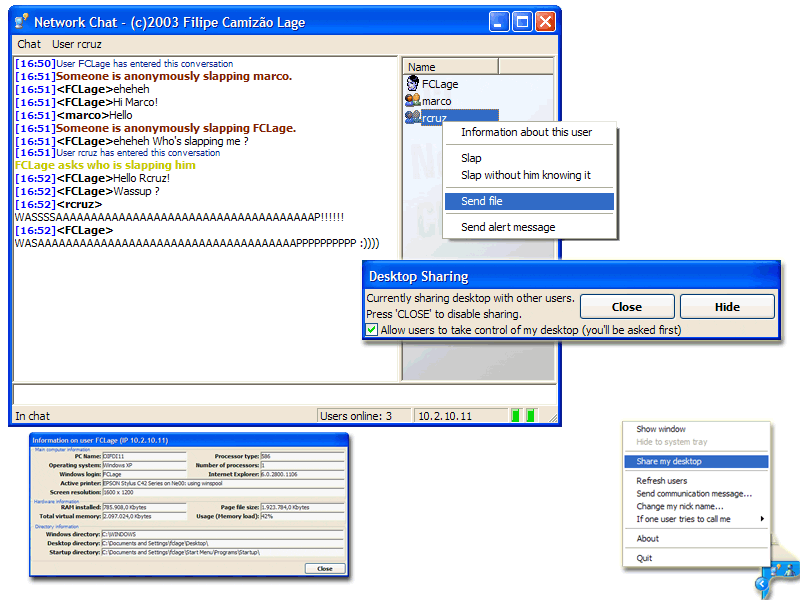



## FCL NetChat \(rev2\) \- Now with remote desktop sharing

### Description

REVISION 2 - UPDATED: June, 18th 2003.

This is a small, simple to use, and commented project for network chat, without using a server. It includes many features as: remote desktop sharing (and viewing), file transfer, remote user computer's information, hide in systray until someone messages, and many more...

It's a small gift and token of my appreciation for www.planet-souce-code.com, since i have consulted PSC many times for info and code examples, and never submited (or contributed) any of my code.

So, here is my contribution. Hope it's useful for someone.

Thank you PSC! :)

Filipe Camizão Lage

fclage@mail.net4b.pt

You may use this code freely in your projects, you can change it, etc, etc, yabayaba, but please

do not remove my name from the credits.
 
### More Info
 

             |
---                |---
**Submitted On**   |2003-06-17 14:34:28
**By**             |[Filipe Lage](https://github.com/Planet-Source-Code/PSCIndex/blob/master/ByAuthor/filipe-lage.md)
**Level**          |Intermediate
**User Rating**    |4.9 (246 globes from 50 users)
**Compatibility**  |VB 6\.0
**Category**       |[Complete Applications](https://github.com/Planet-Source-Code/PSCIndex/blob/master/ByCategory/complete-applications__1-27.md)
**World**          |[Visual Basic](https://github.com/Planet-Source-Code/PSCIndex/blob/master/ByWorld/visual-basic.md)
**Archive File**   |[FCL\_NetCha1602636182003\.zip](https://github.com/Planet-Source-Code/filipe-lage-fcl-netchat-rev2-now-with-remote-desktop-sharing__1-46152/archive/master.zip)

